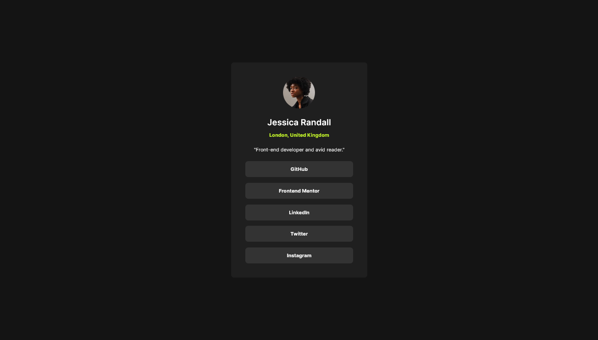

# Frontend Mentor - Social links profile solution

This is a solution to the [Social links profile challenge on Frontend Mentor](https://www.frontendmentor.io/challenges/social-links-profile-UG32l9m6dQ). Frontend Mentor challenges help you improve your coding skills by building realistic projects. 

## Table of contents

- [Overview](#overview)
  - [The challenge](#the-challenge)
  - [Screenshot](#screenshot)
  - [Links](#links)
- [My process](#my-process)
  - [Built with](#built-with)
  - [What I learned](#what-i-learned)
  - [Useful resources](#useful-resources)
- [Author](#author)

## Overview

### The challenge

Users should be able to:

- See hover and focus states for all interactive elements on the page

### Screenshot

### Links

- Solution URL: [Solution URL](https://www.frontendmentor.io/solutions/social-links-profile-challenge--BW4ZHxrVC)
- Live Site URL: [Live Site URL](https://nanikore0.github.io/social-links-profile-main/)

## My process

### Built with

- Semantic HTML5 markup
- CSS3
- Flexbox
- CSS Grid
- Mobile-first workflow

### What I learned

With this project I was able to better understand concepts like the CSS Box Model and also CSS Grid.

### Useful resources

- [CSS Grid Layout Module by w3schools](https://www.w3schools.com/css/css_grid.asp) - This helped me understand how to use CSS Grid.
- [CSS Box Model by w3schools](https://www.w3schools.com/Css/css_boxmodel.asp) and [Learn Box Model by web.dev](https://web.dev/learn/css/box-model/) - This helped me to better understand how the box model works.
- [A (more) Modern CSS Reset on Piccalilli](https://piccalil.li/blog/a-more-modern-css-reset/) - This is article helped me to better manipulate the box model.

## Author

- Github - [nanikore](https://github.com/nanikore0)
- Frontend Mentor - [@nanikore](https://www.frontendmentor.io/profile/nanikore0)
